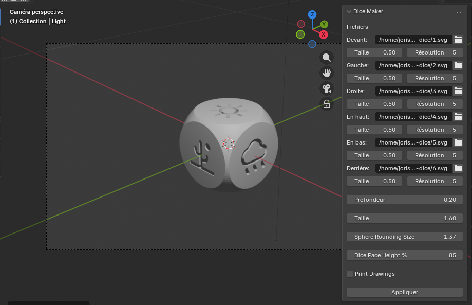

# Dice Maker - Add-on Blender

Un add-on Blender pour créer des dés personnalisés en utilisant des fichiers SVG pour les faces.



## Prérequis

- **Blender 5.0.0** ou version ultérieure
- Aucune dépendance externe requise (utilise uniquement les modules intégrés de Blender)

## Installation

### Méthode 1 : Installation via fichier ZIP (Recommandée)

1. **Télécharger ou cloner le dépôt**
   ```bash
   git clone https://github.com/votre-username/blender-add-on_dice-maker.git
   ```

2. **Créer un fichier ZIP du dossier**
   
   **Option A : Utiliser les scripts fournis (Recommandé)**
   - Sur **Linux/macOS** : Exécutez `./create_zip.sh` dans le dossier du projet
   - Sur **Windows** : Double-cliquez sur `create_zip.bat` ou exécutez-le dans l'invite de commande
   
   **Option B : Création manuelle**
   - Sur **Windows** : Clic droit sur le dossier → "Envoyer vers" → "Dossier compressé"
   - Sur **macOS** : Clic droit sur le dossier → "Compresser"
   - Sur **Linux** : 
     ```bash
     cd blender-add-on_dice-maker
     zip -r dice-maker.zip . -x "*.git*" -x "__pycache__/*" -x "*.pyc" -x "*.png"
     ```
   
   **Important** : Le fichier ZIP doit contenir directement les fichiers Python (`__init__.py`, `dice_maker_panel.py`, etc.) à la racine du ZIP, pas dans un sous-dossier. Si vous créez le ZIP manuellement, assurez-vous de sélectionner les fichiers directement, pas le dossier parent.

3. **Installer dans Blender**
   - Ouvrez Blender
   - Allez dans `Edit` → `Preferences` → `Add-ons`
   - Cliquez sur `Install...` en haut à droite
   - Sélectionnez le fichier `dice-maker.zip`
   - Cliquez sur `Install Add-on`
   - Activez l'add-on en cochant la case à côté de "Dice Maker" dans la liste

### Méthode 2 : Installation manuelle

1. **Trouver le dossier des add-ons de Blender**
   - Ouvrez Blender
   - Allez dans `Edit` → `Preferences` → `File Paths`
   - Notez le chemin du dossier "Scripts" (par exemple : `C:\Users\VotreNom\AppData\Roaming\Blender Foundation\Blender\5.0\scripts\addons\`)

2. **Copier les fichiers**
   - Créez un dossier nommé `dice_maker` dans le dossier des add-ons
   - Copiez tous les fichiers Python du projet dans ce dossier :
     - `__init__.py`
     - `dice_maker_panel.py`
     - `dice_maker_operator.py`
     - `dice_maker_svg.py`

3. **Activer l'add-on**
   - Allez dans `Edit` → `Preferences` → `Add-ons`
   - Recherchez "Dice Maker" dans la barre de recherche
   - Cochez la case pour activer l'add-on

## Utilisation

1. Une fois l'add-on installé et activé, allez dans la vue 3D
2. Ouvrez le panneau latéral (appuyez sur `N` si nécessaire)
3. Cherchez l'onglet "Dice Maker"
4. Sélectionnez les fichiers SVG pour chaque face du dé (6 faces)
5. Ajustez les paramètres selon vos besoins
6. Cliquez sur "Créer le dé" pour générer votre dé personnalisé

## Désinstallation

1. Ouvrez Blender
2. Allez dans `Edit` → `Preferences` → `Add-ons`
3. Recherchez "Dice Maker"
4. Décochez la case pour désactiver l'add-on
5. (Optionnel) Cliquez sur `Remove` pour supprimer complètement l'add-on

## Structure du projet

```
blender-add-on_dice-maker/
├── __init__.py              # Point d'entrée de l'add-on
├── dice_maker_panel.py      # Interface utilisateur
├── dice_maker_operator.py   # Opérateurs Blender
├── dice_maker_svg.py        # Traitement des fichiers SVG
├── create_zip.sh            # Script pour créer le ZIP (Linux/macOS)
├── create_zip.bat           # Script pour créer le ZIP (Windows)
├── LICENSE                  # Licence
└── README.md                # Ce fichier
```

## Notes importantes

- **Structure du ZIP** : Lors de la création du fichier ZIP pour l'installation, les fichiers Python doivent être directement à la racine du ZIP, pas dans un sous-dossier. Les scripts `create_zip.sh` et `create_zip.bat` s'en chargent automatiquement.
- **Version de Blender** : Cet add-on nécessite Blender 5.0.0 ou une version ultérieure.

## Licence

Voir le fichier `LICENSE` pour plus d'informations.

## Support

Pour signaler des bugs ou proposer des améliorations, veuillez ouvrir une issue sur le dépôt GitHub.
